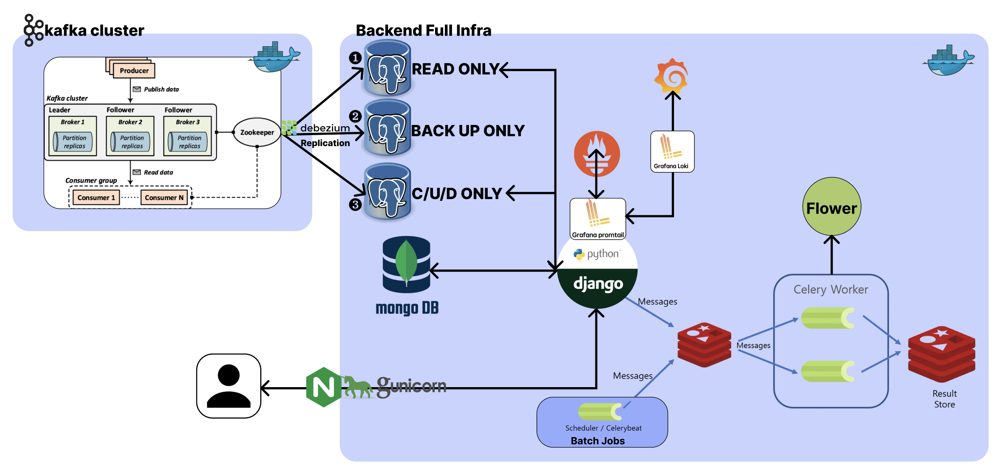
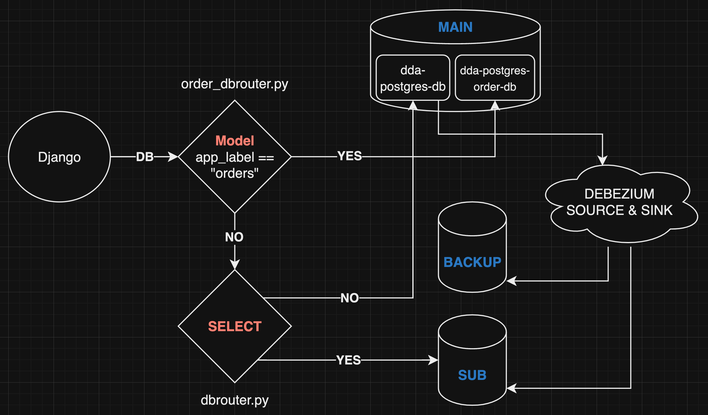

[](https://hits.seeyoufarm.com)

<center>

  

</center>

***[ 아직 완성이 아닙니다! 지속적으로 아래 해당하는 주제들이 코드 level에서도 업데이트 될 예정입니다!!! ]***

# All About Django (almost)

> [블로그 글](https://velog.io/@qlgks1/series/Django-Basic-to-Advanced) 과 같이 본다면 더 이해하기 쉽다.
> Django 로 가능한 다양한 형태의 실습, 테스트 케이스
> complex - boilerplate

- 우선 config, settings 값 등 환경 변수로 다뤄야 할 것들을 철저하게 단순 **테스트를 위해 파일에 같이 저장되어 있는 점 유의**
- DB 관련도 DBMS와 소통할 때 **auth, localhost 인 점도 꼭 유의** , mongodb 는 auth가 optional
- User는 refresh 없는 1년 유효 jwt token (django simplejwt), 인가는 drf 기본 Authorization만 사용
  - User 대충하려다가 조금 token 세팅 빡세게 해버렸다..
- admin (super user)는 특별한 custom 없이 진행
- exception은 커스텀 없이 진행

## Infra & Requirements

- Django + DRF (Django RestFrameWork)
- Gunicorn (wsgi)
- Celery, Celery Beat
- Redis
- Postgresql (***3대***, not clustering, each stand alone)
  - default Postgresql에 DATABASE를 2개 나눠서 사용 (daa-postgres-db & daa-postgres-order-db)
  - Insert-Update-Delete-only DB : **`default`**
  - Select-only DB (**duplication**) : **`sub`**
  - just back-up (**duplication**) DB
- Mongodb
  - dbrouter에 따로 등록하지 않고, django ORM 사용하지 않음
  - 특수 목적을 대상으로, pymongo와 같은 **ODM 활용**
- Nginx
- DevOps: Monitoring & Debugging
  - Flower
  - Prometheus
  - Grafana & Loki & Promtail
- Kafka cluster
  - 3 zookeper & 3 kafka & kafka-manager

## 🔥 Getting Start

### 1) requirements

1. git
2. docker & docker compose
3. MacOS or Linux Based OS (recommanded)

### 2) project init & start

1. `git clone`

2. 우선 `docker` 하위에 있는 `env` 파일을 `django_all_about/config/settings` 로 copy & paste 하자
- 이름은 `.env` 로 copy 한다. 이유는 `python-environ` 모듈을 사용하기 때문이다.
- 참고로 env 값 바뀌면 2개의 file을 update 해주자, `django_all_about > .env` & `docker > env`
- 그리고 `django_all_about` 하위 `.env`는 **버전관리 대상에서 빠진다.**
- `cp ./docker/env ./django_all_about/config/settings/.env` (최상위 경로 기준 커멘드)

3. `django_all_about` 가서 필수 base image가 될 django image를 만들자
- 참고로 `django_all_about` 경로 이동을 꼭 해야한다! 상대 경로 설정들 때문!
- `docker build -t daa-django -f ./Dockerfile .`
- 해당 경로에 ***러닝 스크립트 관련 scripts***, `requirements.txt` 가 있으니 필참

4. `docker` 디렉토리로 가서 `docker-start.sh` 실행 (ex - `source docker-start.sh`)
- 상대 경로 등의 설정으로 인해 **꼭 해당 디렉토리로 가서 shell을 실행**시키자.
- 최초 실행시 celery-beat 등의 경우 migrate issue로 죽을 수 있으니 re-start를 다시 해주자
- 모든 실행후 http://localhost/admin 으로 접속
  - 8000으로 바인딩했으면서 왜 80으로 가냐? docker - nginx conf 참조, 리버스 프록시 세팅 모두 되어있음

5. [optinal] VScode Python Linting & Debugging
- [python - flake8, Black](https://velog.io/@qlgks1/Python-flake8-Black-%EB%8F%84%EC%9E%85-clean-code-%EC%8B%A4%EC%B2%9C%ED%95%98%EA%B8%B0#vscode-git%EA%B3%BC-%EC%84%9E%EC%96%B4-%EC%82%AC%EC%9A%A9%ED%95%98%EA%B8%B0) 글과 같이 flake8, Black & flake8, pre-commit 으로 linting 가능하다. (`.flake8` & `.pyproject.toml` 참조)
- vscode에서 save시 linting과 같은 세팅도 되어있다. (`.vscode > settings.json` 참조)
- vscode에서 디버깅 러닝도 가능한 (runserver debugging & shell debugging) 세팅도 되어 있다. (`.vscode > launch.json` 참조)

### 3) Local (self) Development

> 우선 `django_all_about >> logs` file logging을 사용하기 때문에 디렉토리 만들어줘야합니다.

1. 개발 환경 구성하기
- 추천하는 방법은 vs-code 등에서 "docker - django" (hostname: `daa-django`)에 붙어서 작업하는 것이다.
- 위 항목 (5)에서 vscode 디버깅을 그대로 사용하려면, 컨테이너에 붙어서 러닝해야 한다 :)

2. 실행만 도커, 작업은 로컬로 구성하기
- `python -m venv .venv & pip install -r requirements.txt` 을 통해 직접 local 환경 구성을 해서 진행을 해도 괜찮다.
- `python manage.py migrate` & `python manage.py migrate --database=orders` 다중 DBMS & 다중 데이터베이스 세팅으로 꼭 해주셔야 합니다.
- 그 이외 실행 관련된 커멘드는 `scripts` 하위 `start-django.sh` 를 보는게 좋다.

### 4) Development - DB detail config

1. mongo user 만들기
- mongo container shell 접근
- mongo --host 127.0.0.1 --port 29019
```shell
use admin
db.createUser(
  {
    user: "nuung",
    pwd:  "daa123!",
    roles: [ { role: "root", db: "admin" } ]
  }
)
db.runCommand('usersInfo')
```
- 이후 `settings > local.py` 의 DB 값 에서 다음 값을 바꿔주면 된다.
```python
  ...
  # 'username': '몽고DB 사용자 계정을 넣어주세요',
  # 'password': "몽고DB 사용자 비밀번호 넣어주세요",
  'username': 'nuung',
  'password': 'daa123!',
  ...
```

2. app 추가를 하려면
- 우선 apis 하위에 추가하려는 app의 디렉토리 (폴더)를 하나 추가한다.
- 그리고 `python manage.py startapp products ./apis/products` 커멘드로 세팅한다
- `urls.py` 와 `serializers.py` 추가로 세팅해서 사용하면 된다.
- `apps.py` 세팅값도 살짝 바꾸는게 좋은데, 이미 있는 것을 참고하길 바란다.

3. 분리된 config > setting 에서 `manage.py shell` 에 접근할 때에는 `python manage.py shell --settings=config.settings.local` 와 같이 option을 추가해 줘야 한다.

4. 기본적인 url 들은 아래와 같다
- `localhost` : main, index but not used
- `localhost/admin` ; django의 핵심, admin 페이지 이다.
- `localhost/swagger/` : 스웨거는 꼭 들어가 보길, 말그대로 swagger로 API 정리되어있는 문서다. drf와 drf_yasg 의 합작이다.
- `localhost/api/...` : API endpoint 의 pre-fix로 "api" 가 붙는다.

5. `python manage.py shell --setting=config.settings.local < ./apis/products/item_dump_generator.py` 커멘드를 통해 dump item generating을 할 수 있다.

6. django 파일 빈번하게 바꾸면서 테스트할 꺼라면, django를 도커라이징에서 제외하고 사용하는 것을 추천 (기본 세팅)

---

## 👨🏽‍💻 Case Study

### 1. 전체 프로젝트 도커라이징 및 다중 데이터베이스 활용하기
- `config > dbrouter.py` 부분과 `config > settings > local.py` 에서 Database setting 부분을 참조해 보자
- model에 `app_lable` 을 붙이는 것과 migrate 진행시 database option을 주는 것

#### 여기서 Kafka & Kafka connect - Debezium 활용
- log-based CDC 환경 구성, 3대의 DB 복제 및 활용
- Debezium 활용하며 추가 plugin을 위해 `debezium/debezium-connector-jdbc` 가 존재합니다.
- 이를 바탕으로 아래 사진과 같이 세팅이 되어 있습니다. duplication set과 distributed DBMS 세팅을 하고 싶다면 아래 블로그 글을 꼭 확인해 주세요!
- ***[카프카 클러스터와 파이썬 (2) - Debezium & Postgresql & Django, log based CDC 만들기 (source & sink connector)](https://velog.io/@qlgks1/%EC%B9%B4%ED%94%84%EC%B9%B4-%ED%81%B4%EB%9F%AC%EC%8A%A4%ED%84%B0%EC%99%80-%ED%8C%8C%EC%9D%B4%EC%8D%AC-2-Debezium-Postgresql-Django-log-based-CDC-%EB%A7%8C%EB%93%A4%EA%B8%B0-source-sink-connector)***




- 만약 단일 DBMS와 다중 DB를 사용하고 싶다면, 그냥 `dbrouter.py` 사용하지 않거나 `DATABASE_ROUTERS` 값을 수정해 주세요!

### 2. 모든 api는 unit test와 coverage와 함께 & github 의 action을 통해 django test build 해보기
- https://github.com/snypy/snypy-backend/blob/master/.github/workflows/test.yml
- model moking 하기, 특히 user model 과 같은 경우

### 3. N:M 을 다루기
- OrderRequest 에서 출발을 해서, 해당 유저가 구매요청(OrderRequest)에 해당하는 모든 item과 seller를 찾아보자
- `OrderRequest 1<-N OrderList N->1 item N->1 seller`

### 4. admin을 admin 답게 커스텀하기
- 기존에 있는 admin을 좀 더 admin이 활용할 수 있게 custom 하기
- createsuperuser 로 만들어지는 superuser 회원가입 template 만들기
- mongodb에 있는 dump data를 보는 template 만들기

### 5. Django middleware 만들기
- `HttpRequest -> HttpResponse` 이 처리 구간에서 time library의 `process_time_ns` 함수를 활용해서 응답 헤더에 추가해 보자.
- `config > custom_middleware.py` 를 확인해 보자.

### 6. DRF response, request 커스텀 자유롭게 하기
- test app (`django_all_about > apis > test > ... `) 부분에서 urls, views, serializers 부분 참고
  - 1:N 일때 1의 역참조 serializer, N의 정참조 serializer
  - 기본 `serializers.Serializer` 의 custom file 만들기
  - `serializers` 의 본질에 조금 더 다가서기, 어떻게 Response를 만드는가
- [Django, DRF Serializers - serializer 파헤치기, 왜 serializer? response가 만들어지기 까지](https://velog.io/@qlgks1/Django-DRF-Serializers-serializer-%ED%8C%8C%ED%97%A4%EC%B9%98%EA%B8%B0-%EC%99%9C-serializer-response%EA%B0%80-%EB%A7%8C%EB%93%A4%EC%96%B4%EC%A7%80%EA%B8%B0-%EA%B9%8C%EC%A7%80) 글과 함께 follow 해주시면 감사합니다.

### 7. Model field index와 퍼포먼스 체커
- 최적화로 들어가는 Django query
- API 스트레스 체크 및 최적화, 캐싱처리하기
  - celery로 실시간 검색어 순위를 비동기적으로 계속해서 변경 및 저장
  - 그 순위 5순위까지 검색 결과값 item search result json를 redis에 캐싱처리하기
  - 계속되는 최적화 및 캐싱처리로 체크

### 8. redis + celery worker / celery beat & redis pub n sub 구조 활용하기
- django -> redis -> celery beat / celery worker (if result) -> redis
- django -> redis message queue (producing) <- queue consumer action
  - 여기서 message queue는 redis를 대체하여 여타 다른 메시징 큐를 사용해도 무방하다.
- 위 2가지를 활용하기, 자세한 내용은 아래 블로그 글들로 대신한다.
- [Django Celery - async worker celery & redis (message que) basic](https://velog.io/@qlgks1/Django-Celery-MQ-message-que)
- [Django Redis - caching, scheduling (task), pub/sub message que](https://velog.io/@qlgks1/Django-Redis-caching-scheduling-task-messaging-celery-async-worker)

### 9. Django & Celery stack 활용하기
- 위에서 더 나아가 celery task에 더 집중한 활용 방법이다. 아래 두 글과 follow up한다면 분명 기본적인 활용에는 쉽게 파악가능할 것이다.
- [Django Celery - 단점, Task & subTask & Signature 비동기 작업 다루기 with network I/O](https://velog.io/@qlgks1/Django-Celery-%EB%8B%A8%EC%A0%90-Task-subTask-Signature-%EB%B9%84%EB%8F%99%EA%B8%B0-%EC%9E%91%EC%97%85-%EB%8B%A4%EB%A3%A8%EA%B8%B0-with-network-IO)
- [Django Celery - Task 그룹 작업, 선후행 Chain, 일괄 처리 (배치) Group & Chord](https://velog.io/@qlgks1/Django-Celery-Task-%EA%B7%B8%EB%A3%B9-%EC%9E%91%EC%97%85-%EC%84%A0%ED%9B%84%ED%96%89-Chain-%EC%9D%BC%EA%B4%84-%EC%B2%98%EB%A6%AC-%EB%B0%B0%EC%B9%98-Group-Chord)

### 10. Server log 수집 & 전체 서버 stack 모니터링 / Prometheus + Grafana (loki, promtail)
- celery를 위한 flower, 그리고 그 metric 정보를 수집할 prometheus, 그 데이터를 시계열 시각화 해주는 grafana
- log를 수집하는 agent promtail, 그리고 log를 알맞게 (특화된) 저장하고 검색에 특화된 loki, 그 데이터를 시계열 시각화 해주는 grafana
- docker compose 를 통해 Up 해도 grafana dashboard 세팅은 직접하는게 좋다. 아래글을 꼭 참조하자!
- [Django Celery - 효과적인 디버깅 & 모니터링: Logging + Flower + Prometheus + Grafana(with Loki & Promtail)](https://velog.io/@qlgks1/Django-Celery-%ED%9A%A8%EA%B3%BC%EC%A0%81%EC%9D%B8-%EB%94%94%EB%B2%84%EA%B9%85-%EB%AA%A8%EB%8B%88%ED%84%B0%EB%A7%81-Logging-Flower-Prometheus-Grafanawith-Loki-Promtail)

### 11. 다양한 곳에서 볼 수 있는 cache 활용하기
- `crawl_dev_quotes_batch` 함수에서 celery periodic task 를 활용해 cache를 update한다.
  - `get_dev_quote` 에서 cached 된 data를 simple하게 어떻게 API로 만드는지 볼 수 있다.

### 12. Kafka cluster with Python & Django
- `docker > kafka-cluster-compose.yml` 의 컴포즈 파일 기반으로 zookeeper 3 - kafka 3의 형태로 clustering된 kafka node 실행
- 실행파일은 `docker > kafka-docker-start.sh`, 쉘파일 존재, 해당 디렉토리로 가서 `source kafka-docker-start.sh` 로 바로 실행 가능
- [카프카 클러스터와 파이썬](https://velog.io/@qlgks1/%EC%B9%B4%ED%94%84%EC%B9%B4-%ED%81%B4%EB%9F%AC%EC%8A%A4%ED%84%B0%EC%99%80-%ED%8C%8C%EC%9D%B4%EC%8D%AC) 글을 참조하시면 좋습니다!

---


[](https://hits.seeyoufarm.com)
